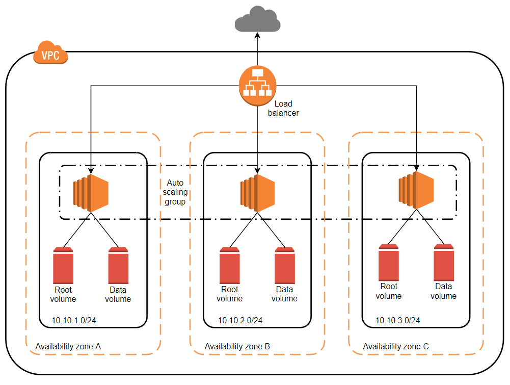
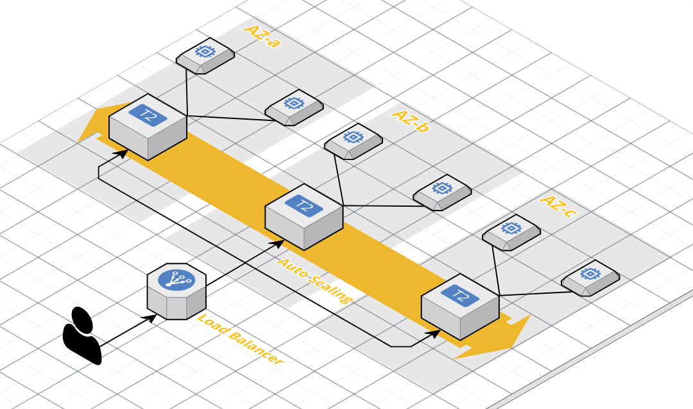

# Hashicorp Consul Cluster on AWS
[](https://travis-ci.org/nthienan/aws-consul-cluster)
  
- ### What you'll build:

  - A virtual private cloud (VPC) configured with public and private subnets across three Availability Zones. This provides the network infrastructure for your HashiCorp Consul deployment.
  - An internet gateway to provide access to the internet
  - Each EC2 instance has two EBS volume. One volume is root volume, and the other is data volume configured for storing consul data only. That is convinent way for backup and restore consul data.
  - An auto scaling group to ensure the number of instances in cluster always is as the desired number. You can specify the number of servers to be created as 3, 5, 7, 9.
  - Architecture:
  
  
  - Architecture 3D:
  

- ### How to deploy:

  - **Build Consul AMI**: Firstly, you have to build AMI from packer template. Then take a note for AMI ID, you'll need it in later steps
    ```bash
    packer build aws-consul-image.json
    ...
    ==> Builds finished. The artifacts of successful builds are:
    --> amazon-ebs: AMIs were created:
    ap-southeast-1: ami-035e1bdc6f1039965
    ```

  - **One click**: 
  
    [](https://console.aws.amazon.com/cloudformation/home?#/stacks/new?stackName=consul-cluster&templateURL=https://s3-ap-southeast-1.amazonaws.com/nthienan-public/cloudformation/aws-consul-cluster/aws-consul-cluster.yaml)

  - **Create stack**:
    ```bash
    aws cloudformation create-stack --stack-name consul-cluster --template-body file://aws-consul-cluster.yaml --capabilities CAPABILITY_IAM --parameters ParameterKey=BaseImageId,ParameterValue=<ami-consul-id> ParameterKey=KeyName,ParameterValue=<existing-ec2-key-pair-name>
    ```

  - **Update stack**:
    ```bash
    aws cloudformation update-stack --stack-name consul-cluster --template-body file://aws-consul-cluster.yaml --parameters ParameterKey=BaseImageId,ParameterValue=<ami-consul-id> ParameterKey=KeyName,ParameterValue=<existing-ec2-key-pair-name>
    ```

  - **Delete stack**:
    ```bash
    aws cloudformation delete-stack --stack-name consul-cluster
    ```

  - **Describe stack**:
    ```bash
    aws cloudformation describe-stacks --stack-name consul-cluster
    ```